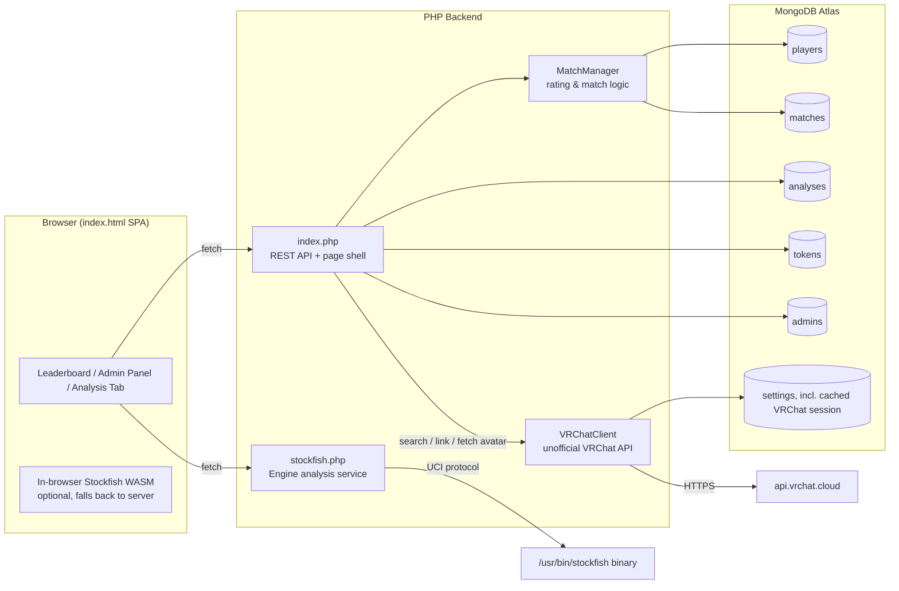
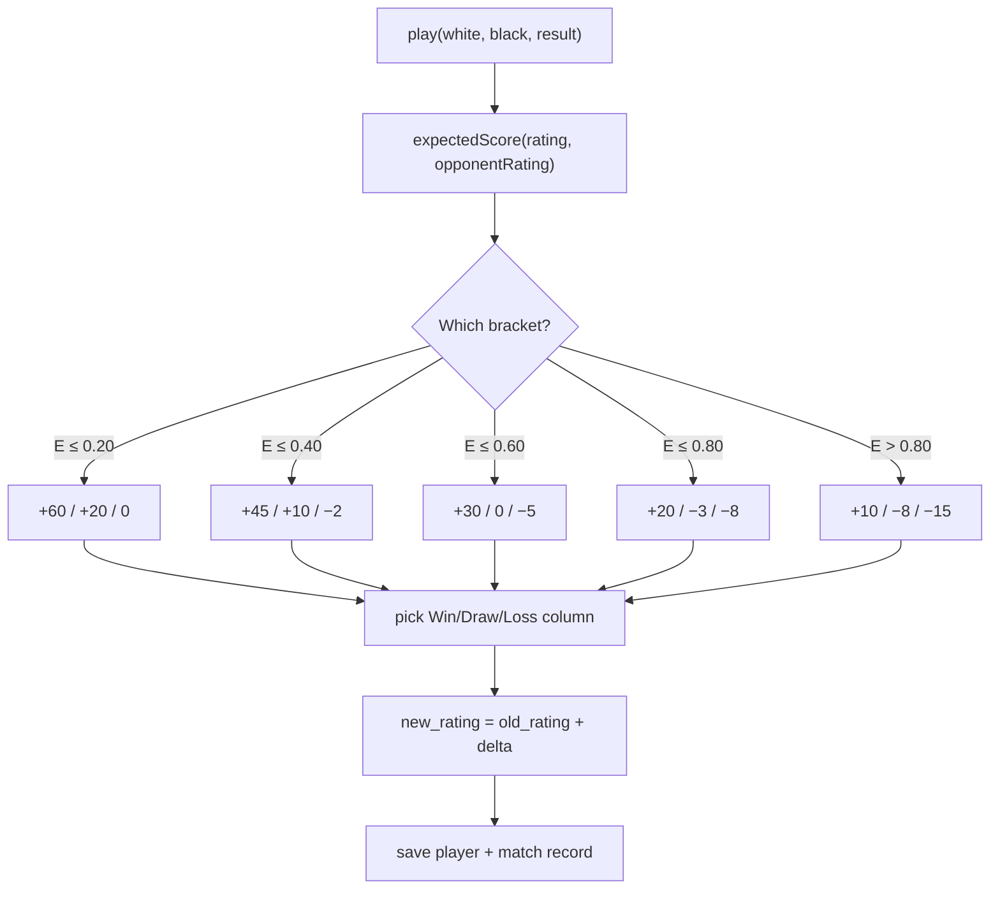
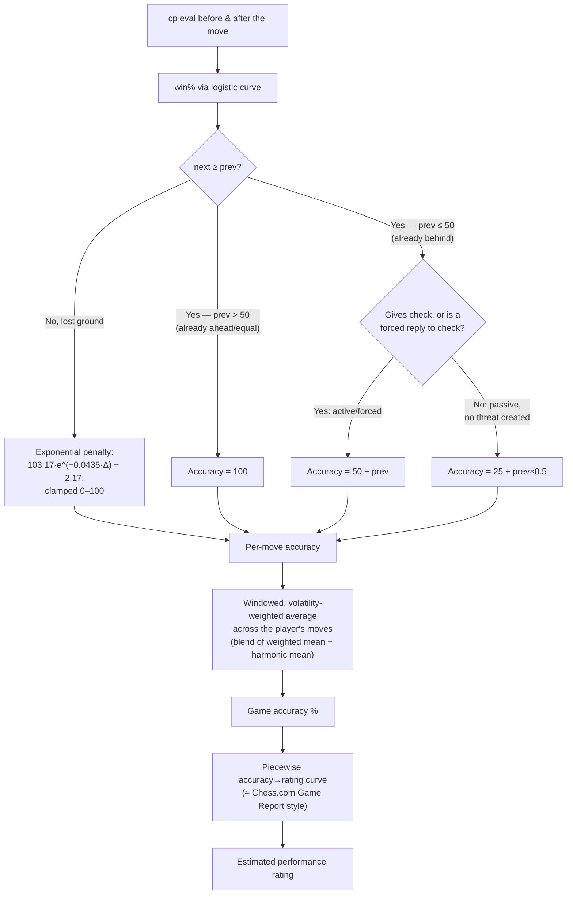

# ♚ VRChess Indonesia — Documentation

**VRChess Indonesia** is a chess rating and match-tracking platform for a VRChat chess community. It combines a custom Elo-style rating system, PHP + MongoDB Atlas backend, a Stockfish 18 analysis engine (server-side and in-browser WASM), and optional integration with VRChat's unofficial API to show players' real VRChat profile pictures on the leaderboard.

This document covers every HTTP endpoint the backend exposes, the rating and move-accuracy formulas behind the numbers, and how to configure the app.

---

## 📋 Table of Contents

1. [Architecture Overview](#-architecture-overview)
2. [Setup & Environment Variables](#-setup--environment-variables)
3. [Authentication](#-authentication)
4. [Base Response Format](#-base-response-format)
5. [Auth & Session Endpoints](#-auth--session-endpoints)
6. [API Token Management (Admin)](#-api-token-management-admin)
7. [Admin User Management (Admin)](#-admin-user-management-admin)
8. [Saved Analysis Endpoints](#-saved-analysis-endpoints)
9. [Player & Ranking Endpoints](#-player--ranking-endpoints)
10. [Match Endpoints](#-match-endpoints)
11. [VRChat Profile Linking (Admin)](#-vrchat-profile-linking-admin)
12. [Avatar Proxy](#-avatar-proxy)
13. [Stockfish Engine Analysis API](#-stockfish-engine-analysis-api-stockfishphp)
14. [Rating System](#-rating-system)
15. [Move Accuracy & Classification Model](#-move-accuracy--classification-model)
16. [Error Handling & Status Codes](#-error-handling--status-codes)

---

## 🏗 Architecture Overview



- **`index.php`** — the single REST API + page entry point. Every request instantiates a fresh `MongoDBDatabaseManager` and `MatchManager`, routes on `$_GET`/`$_SERVER['REQUEST_METHOD']`, and falls through to serving `index.html` (the SPA shell) if no API route matches.
- **`stockfish.php`** — a separate, independent service that shells out to a local Stockfish binary via UCI. Used both for the "Submit Match" PGN analysis and the interactive Analysis tab (server-side fallback when the in-browser WASM engine isn't available).
- **`MatchManager`** (`src/Logic/MatchManager.php`) — owns players/matches, the rating calculation, and match validation/invalidation (which triggers a full chronological rating replay).
- **`VRChatClient`** (`src/Connection/VRChatClient.php`) — a minimal client for VRChat's *unofficial* API (not published/supported by VRChat). Logs in with a dedicated VRChat account (Authenticator App/TOTP 2FA), caches the session cookie in the `settings` collection, and exposes user search + lookup.
- **Storage** — MongoDB Atlas via `MongoDBDatabaseManager`. `CSVDatabaseManager`/`SQLDatabaseManager` exist as alternative implementations of the same `DatabaseManager` interface but are not wired into `index.php`.

---

## ⚙️ Setup & Environment Variables

Copy `example.env` to `.env` and fill in:

| Variable | Required | Purpose |
| :--- | :--- | :--- |
| `MONGODB_URI` | Yes | MongoDB Atlas connection string. |
| `MONGODB_USERNAME` / `MONGODB_PASSWORD` | Yes | Referenced inside `MONGODB_URI`. |
| `ADMIN_PASSWORD` | Legacy fallback | Only used to bootstrap the first admin (`admin`) if the `admins` collection is empty. Once any admin exists, this is ignored — manage admins via the Admin Panel/API instead. |
| `VRCHAT_USERNAME` / `VRCHAT_PASSWORD` | Optional | A VRChat account dedicated to this app. Leave blank to disable the whole VRChat avatar feature — the leaderboard falls back to generated initials avatars. |
| `VRCHAT_TOTP_SECRET` | Optional | The Base32 **manual-entry secret** from VRChat's "Two-Factor Authentication → Enter the key manually" setup screen — *not* a 6-digit code (those rotate every 30s and can't be stored). Only Authenticator App 2FA is supported; email-code 2FA can't be completed unattended. |
| `VRCHAT_CONTACT` | Optional | Free-text contact info appended to the `User-Agent` header VRChat's API requires (e.g. an email). |

Dependencies (`composer.json`): `mongodb/mongodb`, `vlucas/phpdotenv`. Requires the PHP `mongodb` and `curl` extensions, and a `stockfish` binary on `PATH` (default `/usr/bin/stockfish`) for `stockfish.php`.

---

## 🔑 Authentication

Two independent auth models exist, layered on the same MongoDB backend:

### 1. Admin session (cookie-based)
Logging in via `?login=1` starts a PHP session (`$_SESSION['is_admin']`). Endpoints marked **Admin Only** below require this session *or* a valid admin username/password sent per-request via headers/params (`X-Admin-Username`/`X-Admin-Password`, or `admin_username`/`admin_password`).

### 2. API Token (for external clients / bots)
Endpoints marked **API Token Required** accept a token via any of:

- **Header**: `X-API-Token: <token>`
- **Header**: `Authorization: Bearer <token>`
- **Query param**: `?token=<token>` or `?api_token=<token>`

An authenticated admin session also satisfies API Token requirements (admins can do everything a token can). Tokens are managed via the [Token endpoints](#-api-token-management-admin) and are looked up with a 5-minute positive / 30-second negative cache.

### Endpoint visibility summary

| Marker | Meaning |
| :--- | :--- |
| **Public** | No auth needed. |
| **API Token Required** | Admin session *or* valid API token. |
| **Admin Only** | Admin session (or admin credentials) required — API tokens are *not* accepted. |

---

## 📡 Base Response Format

Every `index.php` and `stockfish.php` JSON response follows:

```json
{ "success": true, "...": "endpoint-specific fields" }
```
```json
{ "success": false, "error": "Human-readable error message (often in Indonesian)" }
```

`stockfish.php`'s error responses omit `success` and just return `{ "error": "..." }`. CORS is wide open (`Access-Control-Allow-Origin: *`) on both services.

---

## 🔐 Auth & Session Endpoints

| # | Action | Method | URL |
| :-: | :--- | :--- | :--- |
| 1 | Auth status | `GET` | `/index.php?auth-status=1` |
| 2 | Login | `GET`/`POST` | `/index.php?login=1` or `POST ?action=login` |
| 3 | Logout | `GET` | `/index.php?logout=1` |

**1. Auth status** — `Public`. Returns `{ success, authenticated, username }`.

**2. Login** — `Public`. Body/query: `username` (default `"admin"`), `password`. On success sets the admin session and returns `{ success:true, authenticated:true, username }`; on failure, `401` with `error`.

**3. Logout** — destroys the session. Returns `{ success:true, authenticated:false }`.

---

## 🎟 API Token Management (Admin)

| # | Action | Method | URL |
| :-: | :--- | :--- | :--- |
| 1 | List tokens | `GET` | `/index.php?tokens=1` |
| 2 | Create token | `GET`/`POST` | `/index.php?create-token=1` or `POST ?action=create-token` |
| 3 | Revoke/delete token | `DELETE` | `/index.php?revoke-token=1&id=<id>` or `DELETE ?token_id=<id>` |
| 4 | Update token | `PATCH` | `/index.php?update-token=1&id=<id>` or `PATCH ?token_id=<id>` |

All **Admin Only**. Token object shape:

```json
{
  "id": "tok_9f3a1b2c4d5e6f70",
  "name": "Discord Bot",
  "token": "vrchess_pat_<32 hex chars>",
  "created_at": "2026-08-30 12:00:00",
  "last_used": "Belum Pernah",
  "is_active": true
}
```

**2. Create token** — body `{ "name": "Discord Bot" }`. Returns `{ success, message, token: {...} }`.
**3. Revoke** — body/query `{ "id": "<token id or raw token string>" }`.
**4. Update** — body `{ "id", "name", "is_active" }`.

> A "Default Web App Token" is auto-created on first request (`ensureDefaultToken()`) and used internally by the frontend SPA.

---

## 👤 Admin User Management (Admin)

| # | Action | Method | URL |
| :-: | :--- | :--- | :--- |
| 1 | List admins | `GET` | `/index.php?admins=1` |
| 2 | Create admin | `POST` | `/index.php?action=create-admin` |
| 3 | Update admin password | `PATCH` | `/index.php?action=update-admin` |
| 4 | Delete admin | `DELETE` | `/index.php?action=delete-admin` |

All **Admin Only**. Admin object: `{ "username": "admin", "created_at": "..." }` (passwords never returned — bcrypt-hashed at rest).

**2. Create** — body `{ "username", "password" }` (password min 4 chars).
**3. Update** — body `{ "username", "password" }` (new password).
**4. Delete** — body/query `{ "username" }`. Cannot delete yourself or the last remaining admin.

---

## 📚 Saved Analysis Endpoints

Analyses are Stockfish-evaluated PGN games, saved so a shareable link (`?analysis=<id>`) can reload them without re-running the engine. `analysis_url` on a match can point at one of these internal IDs, or at an arbitrary external URL (lichess.org, chessigma.com, chess.com, etc.).

| # | Action | Method | URL | Auth |
| :-: | :--- | :--- | :--- | :--- |
| 1 | Save analysis | `POST` | `/index.php?action=save-analysis` | Public |
| 2 | Update analysis | `PATCH` | `/index.php?action=update-analysis&id=<id>` | Public |
| 3 | Get one analysis | `GET` | `/index.php?action=get-analysis&id=<id>` | Public |
| 4 | List all analyses | `GET` | `/index.php?action=get-analyses` | Public |
| 5 | Delete analysis | `DELETE` | `/index.php?action=delete-analysis&id=<id>` | API Token Required |

**1. Save** — body `{ "pgn": "<PGN text>", "analysis": [ ...positions ] }` (`analysis` optional — can be attached later via #2, e.g. once background Stockfish evaluation finishes). Returns `{ success, id }` — a 16-char hex ID.

**3. Get one** — returns `{ success, data: { id, pgn, created_at, analysis? } }`, where `analysis` (if present) is the full array of evaluated positions (see [move accuracy model](#-move-accuracy--classification-model) for each position's shape: `fen`, `move_san`, `score_cp`, `score_type`, `bestmove`, `pv`, `multipv`, `depth`).

**4. List all** — lightweight; omits the heavy `analysis` array. Returns `{ success, analyses: [{ id, created_at, pgn_preview, headers }] }`, where `headers` is the parsed PGN tag pairs (`White`, `Black`, `WhiteElo`, `Result`, `Event`, ...).

---

## 🏆 Player & Ranking Endpoints

| # | Action | Method | URL | Auth |
| :-: | :--- | :--- | :--- | :--- |
| 1 | List players | `GET` | `/index.php?players=1` | Public |
| 2 | Rankings (sorted) | `GET` | `/index.php?rankings=1` | Public |
| 3 | Single player stats | `GET` | `/index.php?player-stats=1&username=<name>` | Public |
| 4 | Edit player | `PATCH` | `/index.php?player=<name>` | API Token Required |
| 5 | Delete player | `DELETE` | `/index.php?player=<name>` | API Token Required |

Player object (from #1/#2 — sorted by `rating` descending, VRChat fields merged in even for unlinked players as `null`):

```json
{
  "id": 7,
  "username": "James-Music 杰姆斯",
  "rating": 642,
  "games": 14,
  "wins": 10,
  "draws": 1,
  "losses": 3,
  "vrchat_user_id": "usr_88e4e686-3678-4516-97c3-c58550f0f1fc",
  "vrchat_display_name": "James-Music 杰姆斯",
  "avatar_url": "https://api.vrchat.cloud/api/1/image/file_.../2/256"
}
```

**3. Single player stats** — `404` with `error` if the username isn't found. Otherwise:

```json
{
  "success": true,
  "stats": {
    "player": { "id": 7, "username": "...", "rating": 642, "games": 14, "wins": 10, "draws": 1, "losses": 3 },
    "total_matches": 14,
    "valid_matches": 14,
    "invalid_matches": 0,
    "current_rating": 642,
    "games": 14,
    "wins": 10,
    "draws": 1,
    "losses": 3
  }
}
```

**4. Edit** — body `{ "rating": 550, "username": "NewName" }` (either/both fields).
**5. Delete** — removes the player record. Does **not** delete their match history (matches keep referencing the now-orphaned player ID, shown as `DeletedPlayer#<id>`).

---

## ⚔ Match Endpoints

| # | Action | Method | URL | Auth |
| :-: | :--- | :--- | :--- | :--- |
| 1 | List all matches | `GET` | `/index.php?matches=1` | Public |
| 2 | List valid matches | `GET` | `/index.php?valid-matches=1` | Public |
| 3 | List invalidated matches | `GET` | `/index.php?invalid-matches=1` | Public |
| 4 | Record a match | `POST` | `/index.php?play=1` | API Token Required |
| 5 | Invalidate a match | `PUT` | `/index.php?match=<id>&invalidate=1` | API Token Required |
| 6 | Revalidate a match | `PUT` | `/index.php?match=<id>&revalidate=1` | API Token Required |
| 7 | Edit a match | `PATCH` | `/index.php?match=<id>` | API Token Required |
| 8 | Delete a match | `DELETE` | `/index.php?match=<id>` | API Token Required |

Match object:

```json
{
  "id": 55,
  "date": "2026-08-31 19:47:52",
  "white_id": 3,
  "black_id": 8,
  "result": "0-1",
  "analysis_url": "f32b937e852c3dea",
  "is_valid": true,
  "old_white_rating": 407,
  "old_black_rating": 545,
  "rating_change_white": -30,
  "rating_change_black": 10
}
```

**4. Record a match** — body:
```json
{ "white": "Alice", "black": "Bob", "result": "1", "pgn": "<optional PGN>", "url": "<optional external analysis URL>" }
```
- `result`: `"1"`/`"1-0"` (White wins), `"0"`/`"1/2-1/2"` (draw), `"-1"`/`"0-1"` (Black wins).
- If `pgn` is provided, it's saved via the analysis endpoints internally and its generated ID becomes `analysis_url` (taking priority over `url`).
- Auto-creates either player (starting rating 400) if they don't already exist.
- Recalculates both players' ratings immediately (see [Rating System](#-rating-system)) and returns `{ success, message, match: { white: {...}, black: {...}, result, match_id, ... } }` with each side's `old_rating`/`new_rating`/`change`/`expected`.

**5/6. Invalidate / Revalidate** — marks a match `is_valid: false`/`true` and **replays every valid match from scratch in chronological order** to recompute all players' ratings (see [Rating System](#-rating-system)). Use this instead of deleting when a match result was disputed/wrong but you want to keep the record.

**7. Edit** — body `{ "result": "0", "analysis_url": "..." }` (either/both). Also triggers a full rating replay.

**8. Delete** — permanently removes the match (no replay-preserving history) and cascade-deletes its internal analysis document if `analysis_url` pointed at one.

---

## 🎮 VRChat Profile Linking (Admin)

Powers cached VRChat profile pictures on the leaderboard. See [Setup](#-setup--environment-variables) for required `.env` keys — all endpoints here return `502` with a clear `error` if VRChat credentials aren't configured or VRChat rejects the login.

| # | Action | Method | URL |
| :-: | :--- | :--- | :--- |
| 1 | Search VRChat users | `GET` | `/index.php?vrchat-search=1&q=<query>` |
| 2 | Link a player | `POST` | `/index.php?action=link-vrchat` |
| 3 | Unlink a player | `POST` | `/index.php?action=unlink-vrchat` |
| 4 | Refresh cached avatars | `POST` | `/index.php?action=refresh-vrchat-avatars` |

All **Admin Only**.

**1. Search** — fuzzy match on VRChat display name (VRChat's exact-username lookup is deprecated/admin-only on their side, so this is the only viable path). Returns `{ success, results: [{ id, displayName, thumbnail }] }` (up to 10).

**2. Link** — body `{ "username": "<leaderboard username>", "vrchat_user_id": "usr_..." }`. Fetches the VRChat user, stores `vrchat_user_id`/`vrchat_display_name`/`avatar_url` on the player, and returns the resolved `vrchat` object.

**3. Unlink** — body `{ "username" }`. Clears the link and cached avatar.

**4. Refresh** — body `{ "force": false }`. Iterates every linked player and re-fetches their avatar if the cache is older than 24h (or always, with `force:true`). Returns `{ success, message, refreshed, skipped, failed }` counts.

---

## 🖼 Avatar Proxy

| Method | URL | Auth |
| :--- | :--- | :--- |
| `GET` | `/index.php?avatar=<username>` | Public |

VRChat's CDN rejects direct browser `` requests outright (its WAF requires a custom `User-Agent` naming the calling app — something only a server-side request can send, and something a browser will never let you override). This endpoint fetches a linked player's cached avatar URL server-side (with the required `User-Agent`, following VRChat's redirect to its signed CDN URL), caches the raw bytes to disk for 24h (`cache/avatars/`, gitignored), and streams them back with a long browser `Cache-Control`. Returns `404` (plain text) if the player has no cached avatar, `502` if VRChat is unreachable and no stale cache exists to fall back on.

---

## 🧠 Stockfish Engine Analysis API (`stockfish.php`)

An independent service (own CORS headers, own error format: `{ "error": "..." }`, no `success` key) that wraps a local Stockfish binary. Accepts parameters from either the query string or a JSON body (merged, body wins). Supports Chess960/Fischer Random via `chess960: true`.

### 1. Single FEN analysis
- **Method**: `GET` or `POST`
- **Params**: `fen` *(required)*, `depth` *(1–99, default 18)*, `movetime` *(ms, 100–10000 — overrides `depth` if given)*, `multipv` *(1–5, default 1)*, `chess960` *(bool)*, `stream` *(bool — see below)*.

```json
{
  "bestmove": "e7e5",
  "score": 0.25,
  "score_type": "cp",
  "depth": 18,
  "pv": ["e7e5", "g1f3", "b8c6"],
  "multipv": { "1": { "score": 25, "score_type": "cp", "pv": ["e7e5", "..."] } }
}
```

**Streaming mode** (`stream=1` or `stream=true`): responds with `Content-Type: text/event-stream` (SSE), throttled to ~30 updates/sec, one `data: {...}` event per depth increment (`{"type":"info", depth, score, bestmove, pv, multipv, ...}`), followed by a final `{"type":"done", ...}` event. Used by the Analysis tab's live evaluation display.

### 2. Batch FEN analysis (full game)
- **Method**: `POST`
- **Body**: `{ "fens": ["<FEN>", ...], "depth": 22, "multipv": 1, "chess960": false }` — `depth` defaults to **22** if omitted (range 1–99; used values in practice: 18 fast / 22 standard / 24 deep / 26 max).

```json
{
  "success": true,
  "count": 2,
  "depth": 22,
  "positions": [
    {
      "fen": "rnbqkbnr/pppppppp/8/8/8/8/PPPPPPPP/RNBQKBNR w KQkq - 0 1",
      "move_index": 0,
      "score": 0.18,
      "score_cp": 18,
      "score_type": "cp",
      "bestmove": "e2e4",
      "pv": ["e2e4", "e7e5", "..."],
      "depth": 22,
      "multipv": {}
    }
  ]
}
```

`score_cp` is always normalized to White's perspective (negated if it's Black to move in that FEN). For forced mates, `score` is `"M<n>"` and `score_cp` is `±9999` — the sign-flattening this causes is exactly what the [accuracy model](#-move-accuracy--classification-model) below has to specifically work around.

---

## ⭐ Rating System

`src/Logic/Rating.php` implements a custom **bracketed-delta** system — conceptually Elo (expected score from the standard logistic formula), but instead of a fixed K-factor it uses a fixed **win/draw/loss point table** selected by how big the rating gap is. This makes upsets swing ratings harder and makes beating a much weaker opponent worth very little.

**Expected score** (standard Elo formula, `400` rating-points ≈ 10× win-probability difference):

$$
E = \frac{1}{1 + 10^{(R_{opponent} - R_{self}) / 400}}
$$

**Points awarded**, selected by `E` (the mover's own expected score against this opponent):

| Expected score `E` | Win | Draw | Loss |
| :--- | :-: | :-: | :-: |
| ≤ 0.20 (huge underdog) | **+60** | +20 | 0 |
| ≤ 0.40 | +45 | +10 | −2 |
| ≤ 0.60 (roughly even) | +30 | 0 | −5 |
| ≤ 0.80 | +20 | −3 | −8 |
| > 0.80 (heavy favorite) | +10 | −8 | **−15** |

Both players are scored independently (each against the other's rating), so a draw between mismatched players moves them in *opposite* directions (the underdog gains, the favorite loses) — unlike a symmetric zero-sum Elo update.



**Match invalidation** doesn't just undo one delta — `invalidateMatch()`/`revalidateMatch()`/`editMatch()` reset every player to rating 400 and **replay all currently-valid matches from scratch in chronological order**, so ratings always reflect exactly the current set of valid matches with no drift from accumulated undo operations.

---

## 📊 Move Accuracy & Classification Model

Used by the Analysis tab (per-game accuracy %, estimated performance rating, move-quality badges) and by leaderboard profile stats. Conceptually similar to Lichess's published accuracy model (win% comparison) — **not** a reproduction of Chess.com's CAPS2, whose exact formula has never been published.

### 1. Win percentage
Centipawn eval → probability of winning, via a logistic curve (steepens the difference between +1 and +2, flattens it between +10 and +11):

$$
P_{win} = \frac{100}{1 + e^{-0.00368208 \times cp}}
$$

### 2. Per-move accuracy
Given the mover's own win% before (`prev`) and after (`next`) their move:

- **If `next < prev`** (lost ground) — exponential penalty on the win% lost:

$$
Accuracy = \max(0, \min(100, 103.1668 \times e^{-0.04354 \times (prev - next)} - 2.1669))
$$

- **If `next ≥ prev`** (didn't lose ground) — **not** an automatic 100. Holding an existing advantage/equal position (`prev > 50`) is full credit, but once a player is already behind (`prev ≤ 50`), a move only keeps full "held the position" credit (`50 + prev`) if it's **active or forced** — it gives check, or is itself a forced reply to being in check. A voluntary move that creates no threat and poses no problem for the opponent scores lower (`25 + prev × 0.5`) instead. This specifically targets a real failure mode: a long tail of forced recaptures and king-shuffling after one blunder used to score as if it were fine play, because none of those moves technically made the position *worse*.



### 3. Game accuracy aggregation
Per-move accuracies are combined with a **volatility-weighted windowed average**, blended 50/50 with their harmonic mean (harmonic mean punishes low outliers — e.g. a single blunder — harder than a plain average would):
1. Split the game's win% sequence into overlapping windows (size 2–8, scaled to game length); weight each move by its window's standard deviation (more volatile stretches count more).
2. `weightedMean` = weighted average of all per-move accuracies.
3. `harmonicMean` = harmonic mean of the same values (unweighted).
4. `Game Accuracy = (weightedMean + harmonicMean) / 2`.

### 4. Estimated performance rating
A piecewise-linear accuracy → rating curve (own best-effort reconstruction, since Chess.com doesn't publish theirs either — see `ACCURACY_RATING_CURVE` in `index.html`):

| Accuracy | 100 | 98 | 95 | 90 | 85 | 80 | 70 | 60 | 50 | 40 | 0 |
| :--- | :-: | :-: | :-: | :-: | :-: | :-: | :-: | :-: | :-: | :-: | :-: |
| Est. rating | 3200 | 2700 | 2400 | 2100 | 1900 | 1700 | 1400 | 1100 | 800 | 550 | 300 |

Linearly interpolated between points. This is a single-game estimate, not a rating measurement — high variance is expected, especially for short/decisive games.

### 5. Move classification badges
Shown as an icon on the move that was just played (Analysis tab board overlay), based on win% lost (`loss`) and context — independent of the accuracy formula above:

| Badge | Condition |
| :--- | :--- |
| 📖 Book | Move ≤ 5, win% between 40–60, `loss < 5` |
| ✨ Brilliant | `loss < 2`, win% ≥ 45, and the position's PV response drops material by ≥ 2 points (a sound sacrifice) |
| 🌟 Great | `loss < 2` and this move beats the 2nd-best engine line by ≥ 18 win% (the only move that holds) |
| 🔥 Blunder | `loss ≥ 20` |
| ❌ Mistake | `loss ≥ 10` |
| ⚠️ Inaccuracy | `loss ≥ 5` |
| ✅ Good | `loss ≥ 1` |
| ⭐ Best | `loss < 1` |

---

## ⚠️ Error Handling & Status Codes

| Code | Status | Meaning |
| :--- | :--- | :--- |
| `200` | OK | Request succeeded. |
| `400` | Bad Request | Invalid/missing input parameters. |
| `401` | Unauthorized | Missing or invalid API Token / Admin Authentication. |
| `404` | Not Found | Player, Match, Token, Admin, Analysis, or Avatar not found. |
| `500` | Internal Server Error | Unhandled server-side exception (`index.php`/`stockfish.php`). |
| `502` | Bad Gateway | VRChat API unreachable, rejected the request, or isn't configured. |
| `204` | No Content | CORS preflight (`stockfish.php` only — `index.php` returns `200` for `OPTIONS`). |

---
*VRChess Indonesia © 2026 — Built for the Indonesian VRChat Chess Community*
