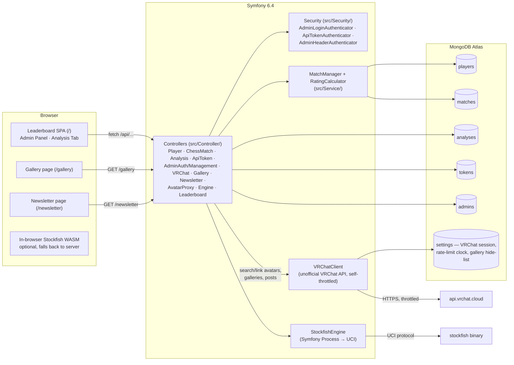
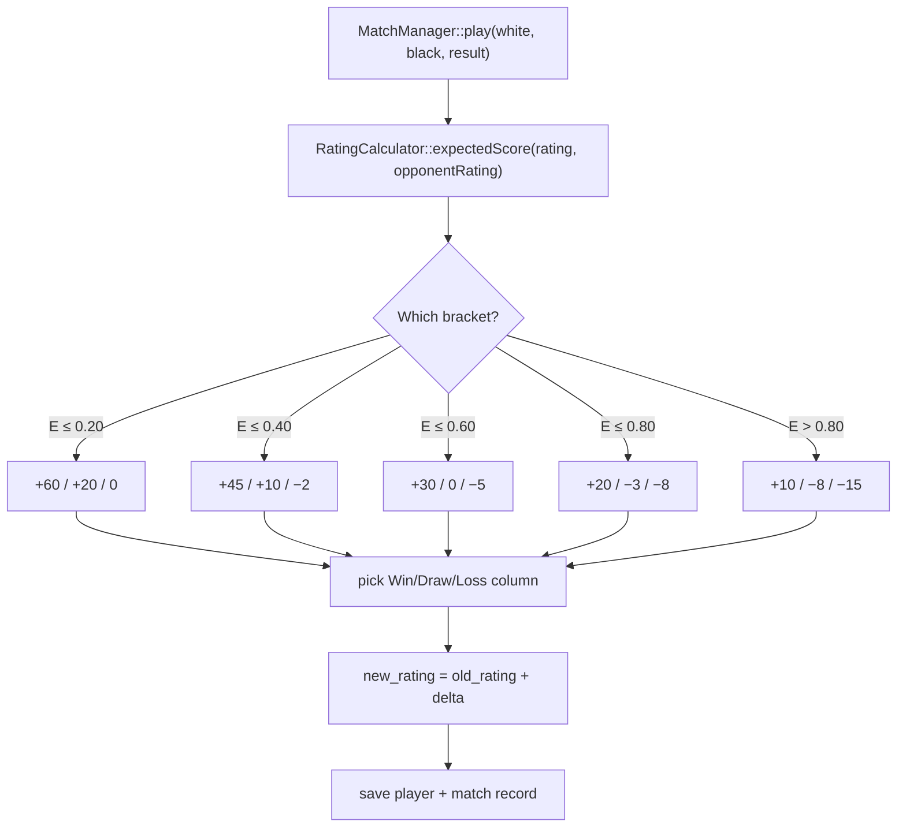
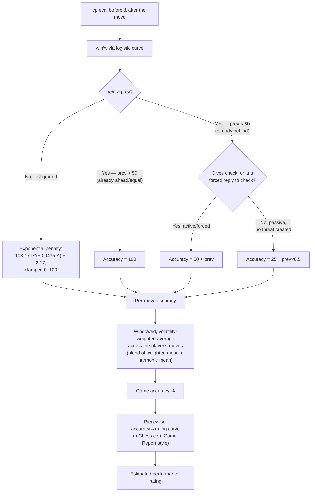

# ♚ VRChess Indonesia — Documentation

**VRChess Indonesia** is a chess rating and match-tracking platform for a VRChat chess community. It combines a custom Elo-style rating system, a Symfony 6.4 + MongoDB Atlas backend, a Stockfish 18 analysis engine (server-side and in-browser WASM), and deep integration with VRChat's unofficial API — real profile pictures on the leaderboard, a photo gallery pulled live from the group's VRChat galleries, and a newsletter pulled live from the group's VRChat posts, all manageable from an in-app admin panel.

This document covers every HTTP endpoint the backend exposes, the rating and move-accuracy formulas behind the numbers, and how to configure and run the app.

## 📋 Table of Contents

1. [Architecture Overview](#-architecture-overview)
2. [Setup & Environment Variables](#-setup--environment-variables)
3. [Authentication](#-authentication)
4. [Base Response Format](#-base-response-format)
5. [Auth & Session Endpoints](#-auth--session-endpoints)
6. [API Token Management (Admin)](#-api-token-management-admin)
7. [Admin User Management (Admin)](#-admin-user-management-admin)
8. [Saved Analysis Endpoints](#-saved-analysis-endpoints)
9. [Player & Ranking Endpoints](#-player--ranking-endpoints)
10. [Match Endpoints](#-match-endpoints)
11. [VRChat Profile Linking (Admin)](#-vrchat-profile-linking-admin)
12. [Avatar Proxy](#-avatar-proxy)
13. [Gallery — VRChat Group Photos](#-gallery--vrchat-group-photos)
14. [Newsletter — VRChat Group Posts](#-newsletter--vrchat-group-posts)
15. [Stockfish Engine Analysis API](#-stockfish-engine-analysis-api)
16. [Rating System](#-rating-system)
17. [Move Accuracy & Classification Model](#-move-accuracy--classification-model)
18. [Error Handling & Status Codes](#-error-handling--status-codes)
19. [Tests](#-tests)

---

## 🏗 Architecture Overview



- **Controllers** (`src/Controller/`) — one per resource, PHP 8 route attributes, thin wrappers over the Service/Repository layer. `AbstractApiController` provides `requireAdmin()`/`requireApiAccess()` (in-controller auth checks, not routing-layer `#[IsGranted]`) plus shared helpers (`normalizeToPng()`, `explainVrchatError()`) used by the Gallery and Newsletter controllers.
- **Documents/Repositories** (`src/Document/`, `src/Repository/`) — Doctrine MongoDB ODM models mapped onto the app's original collections/fields (`players`, `matches`, `analyses`, `tokens`, `admins`, `settings`). No data migration ever happened; the schema is unchanged from the app's first version.
- **`MatchManager`** (`src/Service/MatchManager.php`) — owns match validation/invalidation, which triggers a full chronological rating replay across every currently-valid match.
- **`RatingCalculator`** (`src/Service/RatingCalculator.php`) — the bracketed win/draw/loss point table (see [Rating System](#-rating-system)).
- **`StockfishEngine`** (`src/Service/Engine/`) — wraps a local Stockfish binary over UCI via Symfony's `Process` component (a long-lived subprocess per analysis call, not shared across requests).
- **`VRChatClient`** (`src/Service/VRChat/VRChatClient.php`) — a client for VRChat's *unofficial* API (not published/supported by VRChat). Logs in with a dedicated VRChat account (Authenticator App/TOTP 2FA), caches the session cookie in the `settings` collection, self-throttles every outbound request to VRChat (see `VRCHAT_RATE_LIMIT_SECONDS` below — the "last request at" clock also lives in `settings`, since a fresh client is constructed per request), and covers user search/lookup, group galleries, and group posts.
- **Security** (`src/Security/`) — one stateful firewall, three chained authenticators: `AdminLoginAuthenticator` (session-establishing login), `AdminHeaderAuthenticator` (per-request `X-Admin-Username`/`X-Admin-Password` header fallback), `ApiTokenAuthenticator` (re-validated fresh every request). `ROLE_ADMIN` implies `ROLE_API_TOKEN` via `role_hierarchy`.
- **Frontend** — `templates/leaderboard.html.twig` renders the main SPA shell; `assets/app.js` (plain, non-Twig-processed vanilla JS, ~4000 lines) drives all of its interactivity, including the Analysis tab's chessboard and Stockfish integration. `assets/css/theme-8bit.css` is the active theme (an NES-inspired pixel-art look); `theme-dark.css` is kept as an alternate. `templates/gallery.html.twig` and `templates/newsletter.html.twig` are separate routed pages (not SPA tabs), linked via `templates/_nav.html.twig`.

---

## ⚙️ Setup & Environment Variables

Copy `example.env` to `.env` and fill in:

| Variable | Required | Purpose |
| :--- | :--- | :--- |
| `MONGODB_URI` | Yes | MongoDB Atlas connection string. |
| `MONGODB_USERNAME` / `MONGODB_PASSWORD` | Yes | Referenced inside `MONGODB_URI`. |
| `MONGODB_DB` | Yes | Database name (`vrchessindo` in production; tests hard-require `vrchessindo_test` as a safety guard — see [Tests](#-tests)). |
| `APP_SECRET` | Yes | Symfony's session/CSRF secret. Generate with `php -r "echo bin2hex(random_bytes(16));"`. |
| `ADMIN_PASSWORD` | Legacy fallback | Only used to bootstrap the first admin (`admin`) if the `admins` collection is empty. Once any admin exists, this is ignored — manage admins via the Admin Panel/API instead. |
| `STOCKFISH_BINARY` | Yes | Path to the Stockfish executable (default `/usr/bin/stockfish`). |
| `VRCHAT_USERNAME` / `VRCHAT_PASSWORD` | Optional | A VRChat account dedicated to this app. Leave blank to disable the whole VRChat feature set — the leaderboard falls back to generated initials avatars, and `/gallery`/`/newsletter` render empty. |
| `VRCHAT_TOTP_SECRET` | Optional | The Base32 **manual-entry secret** from VRChat's "Two-Factor Authentication → Enter the key manually" setup screen — *not* a 6-digit code (those rotate every 30s and can't be stored). Only Authenticator App 2FA is supported; email-code 2FA can't be completed unattended. |
| `VRCHAT_CONTACT` | Optional | Free-text contact info appended to the `User-Agent` header VRChat's API requires (e.g. an email). |
| `VRCHAT_GROUP_ID` | Optional | Required for `/gallery` and `/newsletter` to show anything — the VRChat group ID (`grp_...`) those pages pull from. |
| `VRCHAT_GROUP_GALLERY_ID` | Optional | Leave blank to auto-discover and combine every gallery the group has (each shown under its own heading on `/gallery`); set to one gallery's ID (`ggal_...`) to show only that one. |
| `VRCHAT_RATE_LIMIT_SECONDS` | Optional | Minimum seconds between the app's own outbound requests to VRChat's API — a self-imposed courtesy throttle, since VRChat's unofficial API publishes no rate-limit numbers but is known to temporarily block accounts that hammer it. Default `1`; bump to `5` if you see VRChat-side errors, `0` disables it. |

Dependencies (`composer.json`): `symfony/framework-bundle`, `symfony/security-bundle`, `symfony/http-client`, `symfony/process`, `symfony/twig-bundle`, `symfony/asset-mapper` + `symfony/asset`, `doctrine/mongodb-odm-bundle`, `mongodb/mongodb`. Requires PHP ≥ 8.1 with the `mongodb` and `gd` extensions (GD normalizes admin-uploaded gallery/post images to PNG before handing them to VRChat), plus a `stockfish` binary on disk.

```bash
composer install
cp example.env .env   # then fill in the real values
php bin/console doctrine:mongodb:schema:create   # if collections/indexes don't exist yet
php bin/console asset-map:compile --env=prod --no-interaction # bake the assets for production
symfony server:start  # or: php -S 127.0.0.1:8000 -t public
```

**Deployment:** the [Dockerfile](Dockerfile) builds a FrankenPHP image (Caddy + PHP in one process); [railway.json](railway.json) pins Railway to build from it directly (Railway doesn't auto-detect a Dockerfile otherwise). Real secrets are injected as Railway environment variables at deploy time — `example.env` is copied to `.env` at build time only so Symfony's Dotenv component has a base file to boot from; it holds no real values. A traditional Apache host also works: the root-level `.htaccess` transparently forwards every request into `public/` (so a vhost pointed at the repo root instead of `public/` still works, URL stays clean) and sets the `Cross-Origin-Opener-Policy`/`Cross-Origin-Embedder-Policy` headers the in-browser Stockfish WASM engine needs for `SharedArrayBuffer`; without them the app just falls back to server-side analysis automatically.

---

## 🔑 Authentication

Two independent auth models exist, layered on the same MongoDB backend:

### 1. Admin session (cookie-based)
`POST /api/admin/login` starts a Symfony session (handled by `AdminLoginAuthenticator`). Endpoints marked **Admin Only** below require this session *or* a valid admin username/password sent per-request via headers (`X-Admin-Username`/`X-Admin-Password`, handled by `AdminHeaderAuthenticator`).

### 2. API Token (for external clients / bots)
Endpoints marked **API Token Required** accept a token via any of:

- **Header**: `X-API-Token: <token>`
- **Header**: `Authorization: Bearer <token>`
- **Query param**: `?token=<token>` or `?api_token=<token>`

An authenticated admin session also satisfies API Token requirements (`ROLE_ADMIN` implies `ROLE_API_TOKEN`). Tokens are managed via the [Token endpoints](#-api-token-management-admin).

### Endpoint visibility summary

| Marker | Meaning |
| :--- | :--- |
| **Public** | No auth needed. |
| **API Token Required** | Admin session *or* valid API token. |
| **Admin Only** | Admin session (or admin credentials) required — API tokens are *not* accepted. |

---

## 📡 Base Response Format

Every JSON endpoint follows:

```json
{ "success": true, "...": "endpoint-specific fields" }
```
```json
{ "success": false, "error": "Human-readable error message (often in Indonesian)" }
```

CORS is wide open (`Access-Control-Allow-Origin: *`) on every route, applied globally by `src/EventListener/CorsListener.php` (including a `204` short-circuit for `OPTIONS` preflight requests).

---

## 🔐 Auth & Session Endpoints

| # | Action | Method | URL |
| :-: | :--- | :--- | :--- |
| 1 | Auth status | `GET` | `/api/auth/status` |
| 2 | Login | `POST` | `/api/admin/login` |
| 3 | Logout | `POST` | `/api/admin/logout` |

**1. Auth status** — `Public`. Returns `{ success, authenticated, username }`.

**2. Login** — `Public`. Body: `{ "username": "admin", "password": "..." }`. On success sets the admin session; on failure, `401`.

**3. Logout** — `Public`. Invalidates the session. Returns `{ success:true, message, authenticated:false }`.

---

## 🎟 API Token Management (Admin)

| # | Action | Method | URL |
| :-: | :--- | :--- | :--- |
| 1 | List tokens | `GET` | `/api/admin/tokens` |
| 2 | Create token | `POST` | `/api/admin/tokens` |
| 3 | Update token | `PATCH` | `/api/admin/tokens/{id}` |
| 4 | Revoke/delete token | `DELETE` | `/api/admin/tokens/{id}` |

All **Admin Only**. Token object shape:

```json
{
  "id": "tok_9f3a1b2c4d5e6f70",
  "name": "Discord Bot",
  "token": "vrchess_pat_<32 hex chars>",
  "created_at": "2026-08-30 12:00:00",
  "last_used": "Belum Pernah",
  "is_active": true
}
```

**2. Create** — body `{ "name": "Discord Bot" }`. Returns `{ success, message, token: {...} }`.
**3. Update** — body `{ "name", "is_active" }`.
**4. Revoke** — deletes the token permanently.

> A "Default Web App Token" is auto-created on first request and used internally by the frontend SPA.

---

## 👤 Admin User Management (Admin)

| # | Action | Method | URL |
| :-: | :--- | :--- | :--- |
| 1 | List admins | `GET` | `/api/admin/admins` |
| 2 | Create admin | `POST` | `/api/admin/admins` |
| 3 | Update admin password | `PATCH` | `/api/admin/admins/{username}` |
| 4 | Delete admin | `DELETE` | `/api/admin/admins/{username}` |

All **Admin Only**. Admin object: `{ "username": "admin", "created_at": "..." }` (passwords never returned — bcrypt-hashed at rest).

**2. Create** — body `{ "username", "password" }` (password min 4 chars).
**3. Update** — body `{ "password" }` (new password).
**4. Delete** — cannot delete yourself or the last remaining admin.

---

## 📚 Saved Analysis Endpoints

Analyses are Stockfish-evaluated PGN games, saved so a shareable link (`?analysis=<id>`) can reload them without re-running the engine. A match's `analysis_url` can point at one of these internal IDs, or at an arbitrary external URL (lichess.org, chessigma.com, chess.com, etc.).

| # | Action | Method | URL | Auth |
| :-: | :--- | :--- | :--- | :--- |
| 1 | Save analysis | `POST` | `/api/analyses` | Public |
| 2 | List all analyses | `GET` | `/api/analyses` | Public |
| 3 | Get one analysis | `GET` | `/api/analyses/{id}` | Public |
| 4 | Update analysis | `PATCH` | `/api/analyses/{id}` | Public |
| 5 | Delete analysis | `DELETE` | `/api/analyses/{id}` | API Token Required |

**1. Save** — body `{ "pgn": "<PGN text>", "analysis": [ ...positions ] }` (`analysis` optional — can be attached later via #4, e.g. once background Stockfish evaluation finishes). Returns `{ success, id }` — a 16-char hex ID.

**3. Get one** — `404` if not found. Otherwise `{ success, data: { id, pgn, created_at, analysis? } }`, where `analysis` (if present) is the full array of evaluated positions (see [move accuracy model](#-move-accuracy--classification-model) for each position's shape: `fen`, `move_san`, `score_cp`, `score_type`, `bestmove`, `pv`, `multipv`, `depth`).

**2. List all** — lightweight; omits the heavy `analysis` array. Returns `{ success, analyses: [{ id, created_at, pgn_preview, headers }] }`, where `headers` is the parsed PGN tag pairs (`White`, `Black`, `WhiteElo`, `Result`, `Event`, ...).

**4. Update** — body `{ "analysis": [...] }`. ⚠️ One real quirk: if `id` doesn't exist, this returns `{success:false}` with HTTP **200**, not 404 — a deliberately preserved behavior of the original endpoint.

---

## 🏆 Player & Ranking Endpoints

| # | Action | Method | URL | Auth |
| :-: | :--- | :--- | :--- | :--- |
| 1 | List players | `GET` | `/api/players` | Public |
| 2 | Rankings (sorted) | `GET` | `/api/rankings` | Public |
| 3 | Single player stats | `GET` | `/api/players/{username}/stats` | Public |
| 4 | Edit player | `PATCH` | `/api/players/{username}` | API Token Required |
| 5 | Delete player | `DELETE` | `/api/players/{username}` | API Token Required |

Player object (from #1/#2 — sorted by `rating` descending, VRChat fields merged in even for unlinked players as `null`):

```json
{
  "id": 7,
  "username": "James-Music 杰姆斯",
  "rating": 642,
  "games": 14,
  "wins": 10,
  "draws": 1,
  "losses": 3,
  "vrchat_user_id": "usr_88e4e686-3678-4516-97c3-c58550f0f1fc",
  "vrchat_display_name": "James-Music 杰姆斯",
  "avatar_url": "https://api.vrchat.cloud/api/1/image/file_.../2/256"
}
```

**3. Single player stats** — `404` if the username isn't found. Otherwise:

```json
{
  "success": true,
  "stats": {
    "player": { "id": 7, "username": "...", "rating": 642, "games": 14, "wins": 10, "draws": 1, "losses": 3 },
    "total_matches": 14,
    "valid_matches": 14,
    "invalid_matches": 0,
    "current_rating": 642,
    "games": 14,
    "wins": 10,
    "draws": 1,
    "losses": 3
  }
}
```

**4. Edit** — body `{ "rating": 550, "username": "NewName" }` (either/both fields).
**5. Delete** — removes the player record. Does **not** delete their match history (matches keep referencing the now-orphaned player ID, shown as `DeletedPlayer#<id>`).

---

## ⚔ Match Endpoints

| # | Action | Method | URL | Auth |
| :-: | :--- | :--- | :--- | :--- |
| 1 | List all matches | `GET` | `/api/matches` | Public |
| 2 | List valid matches | `GET` | `/api/matches/valid` | Public |
| 3 | List invalidated matches | `GET` | `/api/matches/invalid` | Public |
| 4 | Record a match | `POST` | `/api/matches` | API Token Required |
| 5 | Invalidate a match | `PUT` | `/api/matches/{id}/invalidate` | API Token Required |
| 6 | Revalidate a match | `PUT` | `/api/matches/{id}/revalidate` | API Token Required |
| 7 | Edit a match | `PATCH` | `/api/matches/{id}` | API Token Required |
| 8 | Delete a match | `DELETE` | `/api/matches/{id}` | API Token Required |

Match object:

```json
{
  "id": 55,
  "date": "2026-08-31 19:47:52",
  "white_id": 3,
  "black_id": 8,
  "result": "0-1",
  "analysis_url": "f32b937e852c3dea",
  "is_valid": true,
  "old_white_rating": 407,
  "old_black_rating": 545,
  "rating_change_white": -30,
  "rating_change_black": 10
}
```

**4. Record a match** — body:
```json
{ "white": "Alice", "black": "Bob", "result": "1", "pgn": "<optional PGN>", "url": "<optional external analysis URL>" }
```
- `result`: `"1"`/`"1-0"` (White wins), `"0"`/`"1/2-1/2"` (draw), `"-1"`/`"0-1"` (Black wins).
- If `pgn` is provided, it's saved via the analysis endpoints internally and its generated ID becomes `analysis_url` (taking priority over `url`).
- Auto-creates either player (starting rating 400) if they don't already exist.
- Recalculates both players' ratings immediately (see [Rating System](#-rating-system)) and returns `{ success, message, match: { white: {...}, black: {...}, result, match_id, ... } }` with each side's `old_rating`/`new_rating`/`change`/`expected`.

**5/6. Invalidate / Revalidate** — marks a match `is_valid: false`/`true` and **replays every valid match from scratch in chronological order** to recompute all players' ratings (see [Rating System](#-rating-system)). Use this instead of deleting when a match result was disputed/wrong but you want to keep the record.

**7. Edit** — body `{ "result": "0", "analysis_url": "..." }` (either/both). Also triggers a full rating replay.

**8. Delete** — permanently removes the match (no replay-preserving history) and cascade-deletes its internal analysis document if `analysis_url` pointed at one.

---

## 🎮 VRChat Profile Linking (Admin)

Powers cached VRChat profile pictures on the leaderboard. See [Setup](#-setup--environment-variables) for required `.env` keys — all endpoints here return `502` with a clear `error` if VRChat credentials aren't configured or VRChat rejects the login.

| # | Action | Method | URL |
| :-: | :--- | :--- | :--- |
| 1 | Search VRChat users | `GET` | `/api/admin/vrchat/search?q=<query>` |
| 2 | Link a player | `POST` | `/api/admin/vrchat/link` |
| 3 | Unlink a player | `POST` | `/api/admin/vrchat/unlink` |
| 4 | Refresh cached avatars | `POST` | `/api/admin/vrchat/refresh-avatars` |

All **Admin Only**.

**1. Search** — fuzzy match on VRChat display name (VRChat's exact-username lookup is deprecated/admin-only on their side, so this is the only viable path). Returns `{ success, results: [{ id, displayName, thumbnail }] }` (up to 10).

**2. Link** — body `{ "username": "<leaderboard username>", "vrchat_user_id": "usr_..." }`. Fetches the VRChat user, stores `vrchat_user_id`/`vrchat_display_name`/`avatar_url` on the player, and returns the resolved `vrchat` object.

**3. Unlink** — body `{ "username" }`. Clears the link and cached avatar.

**4. Refresh** — body `{ "force": false }`. Iterates every linked player and re-fetches their avatar if the cache is older than 24h (or always, with `force:true`). Returns `{ success, message, refreshed, skipped, failed }` counts.

---

## 🖼 Avatar Proxy

| Method | URL | Auth |
| :--- | :--- | :--- |
| `GET` | `/api/avatar/{username}` | Public |

VRChat's CDN rejects direct browser `` requests outright (its WAF requires a custom `User-Agent` naming the calling app — something only a server-side request can send). This endpoint fetches a linked player's cached avatar URL server-side and streams the bytes back, caching them in the `cache.avatars` PSR-6 pool for 24h with a "serve the stale copy rather than nothing" fallback if a refetch fails. Returns `404` (plain text) if the player has no cached avatar, `502` if VRChat is unreachable and no stale cache exists to fall back on.

---

## 🖼 Gallery — VRChat Group Photos

`/gallery` pulls every approved photo straight from the VRChat group's own gallery/galleries (`VRCHAT_GROUP_ID` + optionally `VRCHAT_GROUP_GALLERY_ID` — see [Setup](#-setup--environment-variables)) and groups them by gallery, each under its own heading. If the group has multiple galleries and `VRCHAT_GROUP_GALLERY_ID` is left blank, all of them are auto-discovered and combined. There's no local fallback content — an unconfigured or unreachable VRChat account just means an empty page.

| # | Action | Method | URL | Auth |
| :-: | :--- | :--- | :--- | :--- |
| 1 | Public gallery page | `GET` | `/gallery` | Public |
| 2 | Proxied photo bytes | `GET` | `/api/gallery/vrchat-image/{imageId}` | Public |
| 3 | List all photos (admin) | `GET` | `/api/admin/gallery/photos` | Admin Only |
| 4 | Hide a photo | `POST` | `/api/admin/gallery/hide` | Admin Only |
| 5 | Unhide a photo | `POST` | `/api/admin/gallery/unhide` | Admin Only |
| 6 | Create a new VRChat gallery | `POST` | `/api/admin/gallery/create-gallery` | Admin Only |
| 7 | Upload a photo into a gallery | `POST` | `/api/admin/gallery/{galleryId}/upload` | Admin Only |
| 8 | Force-refresh the cache | `POST` | `/api/admin/gallery/refresh` | Admin Only |

**2. Proxied bytes** — same VRChat-CDN-needs-a-real-User-Agent reasoning as the avatar proxy. The `imageId` is looked up against the server's own already-fetched, cached photo list rather than trusting a client-supplied URL, so this can't be used to fetch arbitrary URLs. Cached for 24h.

**3. Admin list** — returns every gallery (including empty ones, e.g. freshly created) with every photo (including hidden ones, flagged as such): `{ success, groupConfigured, galleries: [{ id, name, photos: [{ id, src, createdAt, hidden }] }] }`.

**4/5. Hide / Unhide** — body `{ "image_id": "ggim_..." }`. Curation layer on top of VRChat's own "approved" flag: hiding a photo removes it from the public `/gallery` grid without touching anything on VRChat's side (no un-approving, no deleting). Stored in the `settings` collection, keyed to the configured group/gallery.

**6. Create gallery** — body `{ "name", "description": "" }`. Mirrors VRChat's own "+ Create Gallery" group-settings action.

**7. Upload** — multipart/form-data, field `file`. Normalizes the image to PNG (via GD) before handing it to VRChat, since VRChat's upload endpoint documents a PNG payload specifically. **Requires VRC+ on the connected VRChat account** — VRChat's Gallery/photo-upload feature is a VRC+ perk, independent of group roles/permissions entirely. Without it, this (and #7 below) return `502` with an error explaining the likely cause.

**8. Refresh** — bypasses the hour-long cache TTL immediately (e.g. right after approving something new in VRChat).

---

## 📰 Newsletter — VRChat Group Posts

`/newsletter` pulls the VRChat group's own "Posts" announcements (`GET /groups/{id}/posts`) and shows every `visibility: public` post — the group's existing content doubles as this site's newsletter, no separate content system. `visibility: group`-only posts stay invisible on the public page but are still visible/editable in the admin panel.

| # | Action | Method | URL | Auth |
| :-: | :--- | :--- | :--- | :--- |
| 1 | Public newsletter page | `GET` | `/newsletter` | Public |
| 2 | Proxied post-image bytes (public posts only) | `GET` | `/api/newsletter/image/{postId}` | Public |
| 3 | List all posts (admin) | `GET` | `/api/admin/newsletter/posts` | Admin Only |
| 4 | Create a post | `POST` | `/api/admin/newsletter/posts` | Admin Only |
| 5 | Edit a post | `PATCH` | `/api/admin/newsletter/posts/{postId}` | Admin Only |
| 6 | Attach/replace a post's image | `POST` | `/api/admin/newsletter/posts/{postId}/image` | Admin Only |
| 7 | Proxied post-image bytes (any post, admin preview) | `GET` | `/api/admin/newsletter/posts/{postId}/image` | Admin Only |
| 8 | Delete a post | `DELETE` | `/api/admin/newsletter/posts/{postId}` | Admin Only |
| 9 | Force-refresh the cache | `POST` | `/api/admin/newsletter/refresh` | Admin Only |

**3. Admin list** — `{ success, groupConfigured, posts: [{ id, title, text, imageId, imageUrl, src, visibility, createdAt, updatedAt }] }` — `src` is the admin-preview proxy URL (works for group-only posts too, unlike #2).

**4. Create** — JSON body `{ "title", "text", "visibility": "group"|"public", "send_notification": false }`. `send_notification: true` pushes a real notification to every group member on VRChat — it's a genuine, visible side effect, not a preview.

**5. Edit** — same body shape as create. VRChat's underlying `PUT` fully replaces the post's editable fields, so the existing image is preserved automatically (looked up server-side) when you don't touch it via #6.

**6. Attach/replace image** — multipart/form-data, field `file`. Separate from #5 (rather than one combined endpoint) because PHP only parses multipart bodies on `POST`, never `PATCH`/`PUT`. Same VRC+ requirement and GD-normalize-to-PNG behavior as the gallery upload.

**8. Delete** — permanently removes the post from the VRChat group. Not undoable.

---

## 🧠 Stockfish Engine Analysis API

Wraps a local Stockfish binary via `StockfishEngine` (Symfony `Process`, UCI protocol). Supports Chess960/Fischer Random via `chess960: true`. All **Public** (read-only, no auth).

### 1. Single FEN analysis
| Method | URL |
| :--- | :--- |
| `GET`/`POST` | `/api/engine/analyze` |

**Params** (query string or JSON body): `fen` *(required)*, `depth` *(1–99, default 18)*, `movetime` *(ms, 100–10000 — overrides `depth` if given)*, `multipv` *(1–5, default 1)*, `chess960` *(bool)*.

```json
{
  "bestmove": "e7e5",
  "score": 0.25,
  "score_type": "cp",
  "depth": 18,
  "pv": ["e7e5", "g1f3", "b8c6"],
  "multipv": { "1": { "score": 25, "score_type": "cp", "pv": ["e7e5", "..."] } }
}
```

### 2. Batch FEN analysis (full game)
| Method | URL |
| :--- | :--- |
| `GET`/`POST` | `/api/engine/analyze/batch` |

**Body**: `{ "fens": ["<FEN>", ...], "depth": 22, "multipv": 1, "chess960": false }` — `depth` defaults to **22** if omitted (range 1–99; used values in practice: 18 fast / 22 standard / 24 deep / 26 max).

```json
{
  "success": true,
  "count": 2,
  "depth": 22,
  "positions": [
    {
      "fen": "rnbqkbnr/pppppppp/8/8/8/8/PPPPPPPP/RNBQKBNR w KQkq - 0 1",
      "move_index": 0,
      "score": 0.18,
      "score_cp": 18,
      "score_type": "cp",
      "bestmove": "e2e4",
      "pv": ["e2e4", "e7e5", "..."],
      "depth": 22,
      "multipv": {}
    }
  ]
}
```

`score_cp` is always normalized to White's perspective (negated if it's Black to move in that FEN). For forced mates, `score` is `"M<n>"` and `score_cp` is `±9999` — the sign-flattening this causes is exactly what the [accuracy model](#-move-accuracy--classification-model) below has to specifically work around.

### 3. Streaming analysis (SSE)
| Method | URL |
| :--- | :--- |
| `GET`/`POST` | `/api/engine/analyze/stream` |

Same params as #1. Responds with `Content-Type: text/event-stream`, one `data: {...}` event per depth increment (`{"type":"info", depth, score, bestmove, pv, multipv, ...}`), followed by a final `{"type":"done", ...}` event. Input is validated *before* the stream's headers are committed, so a bad FEN gets a clean JSON error instead of malformed bytes spliced into an SSE stream — only errors during the live analysis itself fall back to an SSE-formatted `{"type":"error"}` event. Used by the Analysis tab's live evaluation display.

---

## ⭐ Rating System

`src/Service/RatingCalculator.php` implements a custom **bracketed-delta** system — conceptually Elo (expected score from the standard logistic formula), but instead of a fixed K-factor it uses a fixed **win/draw/loss point table** selected by how big the rating gap is. This makes upsets swing ratings harder and makes beating a much weaker opponent worth very little.

**Expected score** (standard Elo formula, `400` rating-points ≈ 10× win-probability difference):

$$
E = \frac{1}{1 + 10^{(R_{opponent} - R_{self}) / 400}}
$$

**Points awarded**, selected by `E` (the mover's own expected score against this opponent):

| Expected score `E` | Win | Draw | Loss |
| :--- | :-: | :-: | :-: |
| ≤ 0.20 (huge underdog) | **+60** | +20 | 0 |
| ≤ 0.40 | +45 | +10 | −2 |
| ≤ 0.60 (roughly even) | +30 | 0 | −5 |
| ≤ 0.80 | +20 | −3 | −8 |
| > 0.80 (heavy favorite) | +10 | −8 | **−15** |

Both players are scored independently (each against the other's rating), so a draw between mismatched players moves them in *opposite* directions (the underdog gains, the favorite loses) — unlike a symmetric zero-sum Elo update.



**Match invalidation** doesn't just undo one delta — invalidating/revalidating/editing a match resets every player to rating 400 and **replays all currently-valid matches from scratch in chronological order**, so ratings always reflect exactly the current set of valid matches with no drift from accumulated undo operations.

---

## 📊 Move Accuracy & Classification Model

Used by the Analysis tab (per-game accuracy %, estimated performance rating, move-quality badges) and by leaderboard profile stats — implemented client-side in `assets/app.js`. Conceptually similar to Lichess's published accuracy model (win% comparison) — **not** a reproduction of Chess.com's CAPS2, whose exact formula has never been published.

### 1. Win percentage
Centipawn eval → probability of winning, via a logistic curve (steepens the difference between +1 and +2, flattens it between +10 and +11):

$$
P_{win} = \frac{100}{1 + e^{-0.00368208 \times cp}}
$$

### 2. Per-move accuracy
Given the mover's own win% before (`prev`) and after (`next`) their move:

- **If `next < prev`** (lost ground) — exponential penalty on the win% lost:

$$
Accuracy = \max(0, \min(100, 103.1668 \times e^{-0.04354 \times (prev - next)} - 2.1669))
$$

- **If `next ≥ prev`** (didn't lose ground) — **not** an automatic 100. Holding an existing advantage/equal position (`prev > 50`) is full credit, but once a player is already behind (`prev ≤ 50`), a move only keeps full "held the position" credit (`50 + prev`) if it's **active or forced** — it gives check, or is itself a forced reply to being in check. A voluntary move that creates no threat and poses no problem for the opponent scores lower (`25 + prev × 0.5`) instead. This specifically targets a real failure mode: a long tail of forced recaptures and king-shuffling after one blunder used to score as if it were fine play, because none of those moves technically made the position *worse*.



### 3. Game accuracy aggregation
Per-move accuracies are combined with a **volatility-weighted windowed average**, blended 50/50 with their harmonic mean (harmonic mean punishes low outliers — e.g. a single blunder — harder than a plain average would):
1. Split the game's win% sequence into overlapping windows (size 2–8, scaled to game length); weight each move by its window's standard deviation (more volatile stretches count more).
2. `weightedMean` = weighted average of all per-move accuracies.
3. `harmonicMean` = harmonic mean of the same values (unweighted).
4. `Game Accuracy = (weightedMean + harmonicMean) / 2`.

### 4. Estimated performance rating
A piecewise-linear accuracy → rating curve (own best-effort reconstruction, since Chess.com doesn't publish theirs either — see `ACCURACY_RATING_CURVE` in `assets/app.js`):

| Accuracy | 100 | 98 | 95 | 90 | 85 | 80 | 70 | 60 | 50 | 40 | 0 |
| :--- | :-: | :-: | :-: | :-: | :-: | :-: | :-: | :-: | :-: | :-: | :-: |
| Est. rating | 3200 | 2700 | 2400 | 2100 | 1900 | 1700 | 1400 | 1100 | 800 | 550 | 300 |

Linearly interpolated between points. This is a single-game estimate, not a rating measurement — high variance is expected, especially for short/decisive games.

### 5. Move classification badges
Shown as an icon on the move that was just played (Analysis tab board overlay), based on win% lost (`loss`) and context — independent of the accuracy formula above. Icon files live in `assets/images/*.png`, resolved to their real AssetMapper URLs via `window.MOVE_ICON_URLS` (injected by `leaderboard.html.twig` before `app.js` loads, since a plain static JS file can't call Twig's `asset()` itself):

| Badge | Icon file | Condition |
| :--- | :--- | :--- |
| 📖 Book | `theoritical_move.png` | Move ≤ 5, win% between 40–60, `loss < 5` |
| ✨ Brilliant | `brilliant.png` | `loss < 2`, win% ≥ 45, and the position's PV response drops material by ≥ 2 points (a sound sacrifice) |
| 🌟 Great | `the_only_move.png` | `loss < 2` and this move beats the 2nd-best engine line by ≥ 18 win% (the only move that holds) |
| 🔥 Blunder | `blunder.png` | `loss ≥ 20` |
| ❌ Mistake | `strange_move.png` | `loss ≥ 10` |
| ⚠️ Inaccuracy | `tactical_move.png` | `loss ≥ 5` |
| ✅ Good | `good_move.png` | `loss ≥ 1` |
| ⭐ Best | `best_move.png` | `loss < 1` |

---

## ⚠️ Error Handling & Status Codes

| Code | Status | Meaning |
| :--- | :--- | :--- |
| `200` | OK | Request succeeded. |
| `400` | Bad Request | Invalid/missing input parameters. |
| `401` | Unauthorized | Missing or invalid API Token / Admin Authentication. |
| `404` | Not Found | Player, Match, Token, Admin, Analysis, Post, Photo, or Avatar not found. |
| `500` | Internal Server Error | Unhandled server-side exception. |
| `502` | Bad Gateway | VRChat API unreachable, rejected the request, isn't configured, or (gallery/newsletter uploads specifically) the connected account lacks VRC+. |
| `204` | No Content | CORS preflight (`OPTIONS`, any route). |

---

## ✅ Tests

```bash
vendor/bin/phpunit
```

Runs against a **dedicated test database** (`MONGODB_DB=vrchessindo_test` in `.env.test`) on the same Atlas cluster — every test's `setUp()` hard-asserts that exact database name before wiping collections, as a safety guard against ever touching the real `vrchessindo` database. VRChat-touching tests rebind `HttpClientInterface` to a shared `MockHttpClient` (`config/services.yaml`'s `when@test:` block) and set `VRCHAT_RATE_LIMIT_SECONDS=0`, so the suite never reaches the real `api.vrchat.cloud` and never pays real throttle-sleep time. Coverage spans the rating/match-invalidation replay logic, every controller's HTTP surface (full-stack `WebTestCase`/`KernelBrowser` requests, not mocked at the controller level), TOTP against the official RFC 6238 test vectors, and the Stockfish subprocess wrapper against the real local binary.

---
*VRChess Indonesia © 2026 — Built for the Indonesian VRChat Chess Community*
